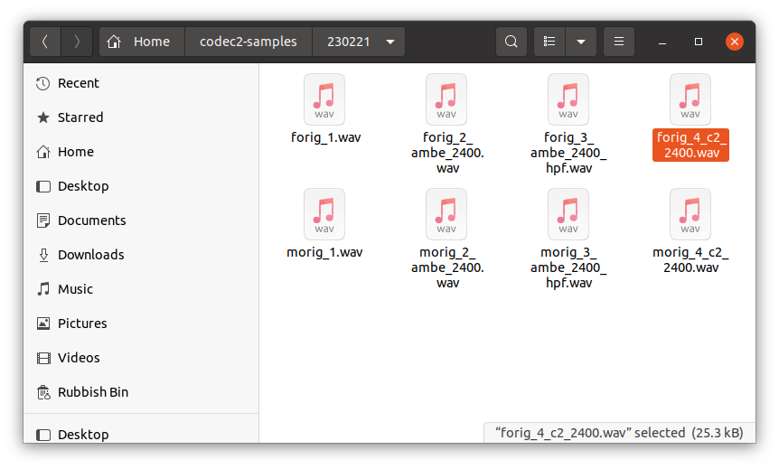

# Codec 2 Samples

A repo to capture snapshots of Codec 2 samples, used for informal listening tests and as a record as the codec evolves.

To listen to them on my Ubuntu Linux machine I arrange them in file browser window with all samples from one speaker on the same row, and [click on each file](https://www.rowetel.com/?p=7884) to play.

# 230217 - AMBE and Codec 2 at 2400 bits/s

Using just two demo samples from the DVSI web site.  It would be nice to augment these with AMBE samples processed from independent source material.

Codec 2 is designed for digital radio applications that use small speakers (e.g. a HF radio or walkie talkie).  The loudspeakers in these radios do not pass low frequencies, with typical -3dB points of 300-500Hz.  Many analog radio systems (SSB and FM) filter speech between 300 and 3000 Hz.  Arguably there is no point in spending bits to preserve these frequencies.  The LPC modelling used in the 1200-3200 Codec 2 modes struggle with low frequency, sometimes leading to unpleasant artefacts. We are therefore proposing to add a high pass filter to Codec 2 to define it's frequency response to match our use case.

AMBE and some other commercial codecs (e.g. MELP) do pass low frequencies quite well.  This can make them sound preferable when using a wide frequency response loudspeaker or good quality headphones.  So this set of samples includes AMBE with and without a 200Hz (-6dB) cut off high pass filter to simulate using a small loudspeaker.

Try listening to them through a small loudspeaker, such as a laptop, as well as good quality headphones.

Sample 5 is an experimental candidate for a new 2400 bit/s mode, using a 3 stage VQ of rate K re-sampled log spectra from the dr-paper branch 9c78ca81.  It would be roughly 1900 bit/s when fully quantised.
